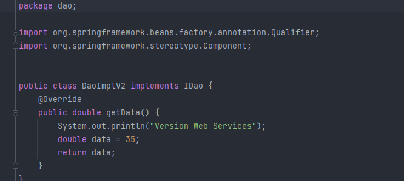
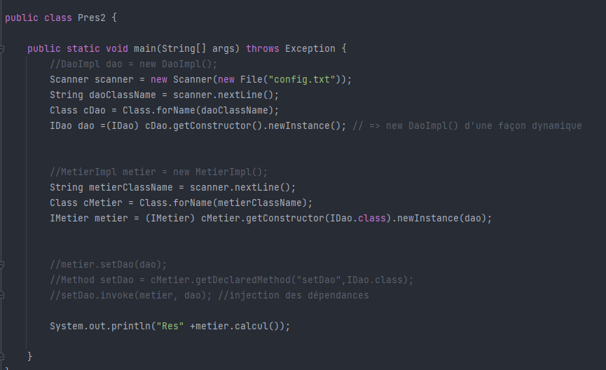
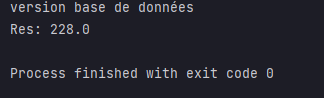

<h1 >Initiation à l'inversion de contrôle et à l'injection des dépendances</h1>

<h2 >Introduction</h2>

L'inversion de contrôle (IoC) est un processus qui permet de spécifier les dépendances d'un objet sans avoir à les instancier. C'est au moment de la création des objets que Spring va injecter les beans entre eux, garantissant que toutes les dépendances sont satisfaites.

Cette approche libère le développeur de la responsabilité de gérer les dépendances techniques, lui permettant de se concentrer sur la logique métier de l'application.

Spring prend en charge l'injection des dépendances et toutes les tâches techniques associées, simplifiant ainsi le développement.

<h2 >Ennoncé</h2>
<ol>
    <li >Couche DAO 
        <ul>
            <li>Créer l'interface IDao</li>
            <li>Créer une implémentation de l'interface IDao</li>
        </ul>
    </li>
    <li>Couche Métier
        <ul>
            <li>Créer l'interface IMetier</li>
            <li>Créer une implémentation de l'interface IMetier</li>
        </ul>
    </li>
    <li >Couche Présentation
        
Créer une application qui permet de faire l'injection des dépendances

        <ul>
            <li>Instantiation statique</li>
            <li>Instantiation dynamique</li>
            <li>En utilisant Spring Framework
                <ul>
                    <li>Version XML</li>
                    <li>Version Annotation</li>
                </ul>
            </li>
        </ul>
    </li>
</ol>

<h2 >Conception</h2>

<h3>Principe du couplage faible</h3>

Pour adopter le principe du couplage faible, l'utilisation d'interfaces est essentielle. Prenons l'exemple d'une classe `DaoImpl` qui implémente l'interface `IDao`, ainsi qu'une classe `MetierImpl` qui implémente l'interface `IMetier`.

Lorsqu'une classe comme `MetierImpl` est associée à l'interface `IDao`, on dit que la classe `MetierImpl` et la classe `IDaoImpl` sont liées par un couplage faible.

Cela signifie que la classe `MetierImpl` peut collaborer avec n'importe quelle classe qui implémente l'interface `IDao`. En réalité, la classe `MetierImpl` ne connaît que l'interface `IDao`. Par conséquent, n'importe quelle classe qui respecte cette interface peut être associée à la classe `MetierImpl`, sans nécessiter de modifications au sein de la classe `MetierImpl`.

Le couplage faible nous offre la possibilité de créer des applications fermées à la modification tout en étant ouvertes à l'extension.

<h2 >Captures d'écran</h2>

<h3>Création de l'interface IDao</h3>

<h3>Création d'une implémentation de l'interface IDao ""version Base de Données"""</h3>

<h3>Création d'une implémentation de l'interface IDao ""version web services"""</h3>

<h3>Création de l'interface IMetier</h3>

<h3>Création d'une implémentation de l'interface IMetier</h3>

<h3>Instantiation statique</h3>

Class presentation 

Démonstartion 

<h3>Instantiation dynamique</h3>

Config.txt

Class presentation 

Démonstartion 

<h3>Injection des dépendances en utilisant Spring version xml</h3>

Config.xml

Class presentation

Démonstartion 

<h3>Injection des dépendances en utilisant Spring version annotations</h3>

Class Repository 

Class Service 

Controller : Class presentation

Démonstartion 

