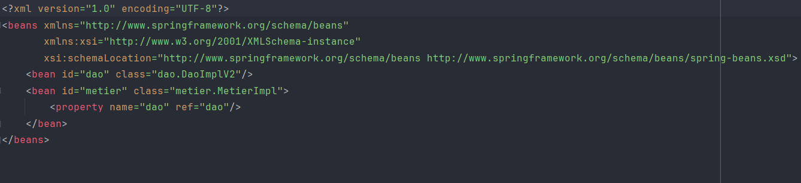
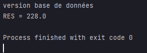

<h1 >Activité Pratique N°1 - Injection des dépendances</h1>

<h2 >Introduction</h2>

La magie derrière l'Inversion de Contrôle (IoC) réside dans la délégation de la gestion des dépendances. Avec IoC, vous définissez les besoins de vos objets sans les construire explicitement. C'est à Spring de jouer les maîtres d'orchestre lors de la création des objets, veillant à ce que les différents composants (beans) soient interconnectés de manière à satisfaire toutes les exigences en matière de dépendances.

Cette méthode décharge le développeur de la tâche fastidieuse de prendre en charge les intrications techniques des dépendances, ce qui lui offre la liberté de se focaliser exclusivement sur la conception de la logique métier de l'application.

Spring s'occupe de l'injection des dépendances et de toutes les opérations techniques connexes, simplifiant ainsi grandement le processus de développement.

<h2 >Ennoncé</h2>
<ol>
    <li >Couche DAO 
        <ul>
            <li>Créer l'interface IDao</li>
            <li>Créer une implémentation de l'interface IDao</li>
        </ul>
    </li>
    <li>Couche Métier
        <ul>
            <li>Créer l'interface IMetier</li>
            <li>Créer une implémentation de l'interface IMetier</li>
        </ul>
    </li>
    <li >Couche Présentation
        
Créer une application qui permet de faire l'injection des dépendances

        <ul>
            <li>Instantiation statique</li>
            <li>Instantiation dynamique</li>
            <li>En utilisant Spring Framework
                <ul>
                    <li>Version XML</li>
                    <li>Version Annotation</li>
                </ul>
            </li>
        </ul>
    </li>
</ol>

<h2 >Conception</h2>

<h3>Principe du couplage faible</h3>

Pour adopter le principe du couplage faible, l'utilisation d'interfaces est essentielle. Prenons l'exemple d'une classe `DaoImpl` qui implémente l'interface `IDao`, ainsi qu'une classe `MetierImpl` qui implémente l'interface `IMetier`.

Lorsqu'une classe comme `MetierImpl` est associée à l'interface `IDao`, on dit que la classe `MetierImpl` et la classe `IDaoImpl` sont liées par un couplage faible.

Cela signifie que la classe `MetierImpl` peut collaborer avec n'importe quelle classe qui implémente l'interface `IDao`. En réalité, la classe `MetierImpl` ne connaît que l'interface `IDao`. Par conséquent, n'importe quelle classe qui respecte cette interface peut être associée à la classe `MetierImpl`, sans nécessiter de modifications au sein de la classe `MetierImpl`.

Le couplage faible nous offre la possibilité de créer des applications fermées à la modification tout en étant ouvertes à l'extension.

<h2 >Captures d'écran</h2>

<h3>Création de l'interface IDao</h3>

<h3>Création d'une implémentation de l'interface IDao ""version Base de Données"""</h3>

<h3>Création d'une implémentation de l'interface IDao ""version web services"""</h3>

<h3>Création de l'interface IMetier</h3>

<h3>Création d'une implémentation de l'interface IMetier</h3>

<h3>Instantiation statique</h3>

Class presentation 

Démonstartion 

<h3>Instantiation dynamique</h3>

Config.txt

Class presentation 

Démonstartion 

<h3>Injection des dépendances en utilisant Spring version xml</h3>

Config.xml

Class presentation

Démonstartion 

<h3>Injection des dépendances en utilisant Spring version annotations</h3>

Class Repository 

Class Service 

Controller : Class presentation

Démonstartion 

